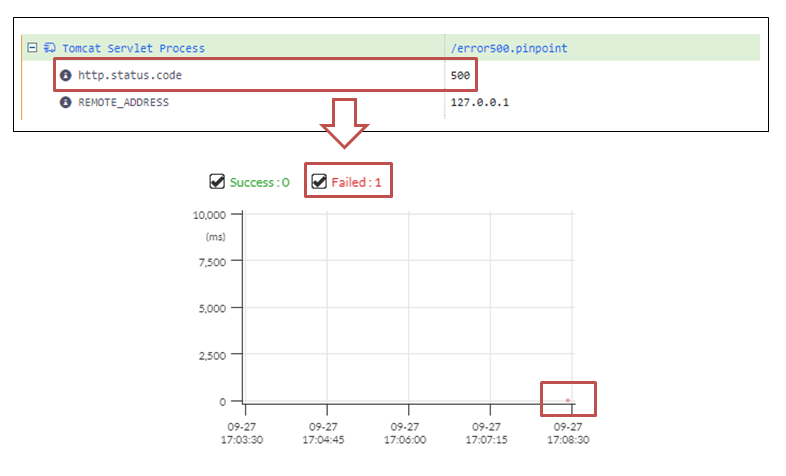

# HTTP Status Code with Request Failure.

## Pinpoint Configuration

pinpoint.config
~~~
profiler.http.status.code.errors=5xx, 401, 403, 406
~~~
Comma separated list of HTTP status codes.
* 1xx: Informational(100 ~ 199).
  * 100: Continue
  * 101: Switching Protocols
* 2xx: Successful(200 ~ 299).
  * 200: OK
  * 201: Created
  * 202: Accepted
  * 203: Non-Authoritative Information
  * 204: No Content
  * 205: Reset Content
  * 206: Partial Content
* 3xx: Redirection(300 ~ 399).
  * 300: Multiple Choices
  * 301: Moved Permanently
  * 302: Found
  * 303: See Other
  * 304: Not Modified
  * 305: Use Proxy
  * 307: Temporary Redirect
* 4xx: Client Error(400 ~ 499).
  * 400: Bad Request
  * 401: Unauthorized
  * 402: Payment Required
  * 403: Forbidden
  * 404: Not Found
  * 405: Method Not Allowed
  * 406: Not Acceptable
  * 407: Proxy Authentication Required
  * 408: Request Time-out
  * 409: Conflict
  * 410: Gone
  * 411: Length Required
  * 412: Precondition Failed
  * 413: Request Entity Too Large
  * 414: Request-URI Too Large
  * 415: Unsupported Media Type
  * 416: Requested range not satisfiable
  * 417: Expectation Failed
* 5xx: Server Error(500 ~ 599).
  * 500: Internal Server Error
  * 501: Not Implemented
  * 502: Bad Gateway
  * 503: Service Unavailable
  * 504: Gateway Time-out
  * 505: HTTP Version not supported

Resources
* https://www.w3.org/Protocols/rfc2616/rfc2616-sec10.html

