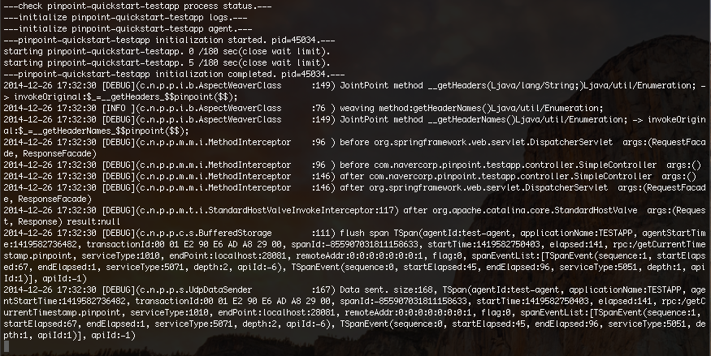

# QuickStart
Pinpoint is comprised of 3 main components (Collector, Web, Agent), and uses HBase as its storage. Collector and Web are packaged as simple WAR files, and the Agent is packaged so that it may be attached to applications as a java agent.

Pinpoint QuickStart provides a sample TestApp for the Agent to attach itself to, and launches all three components using [Tomcat Maven Plugin](http://tomcat.apache.org/maven-plugin.html).

## Requirements
In order to build Pinpoint, the following requirements must be met:

* JDK 6 installed
* JDK 7 installed
* JDK 8 installed
* Maven 3.2.x+ installed
* JAVA_6_HOME environment variable set to JDK 6 home directory.
* JAVA_7_HOME environment variable set to JDK 7 home directory.
* JAVA_8_HOME environment variable set to JDK 8+ home directory.
* MAVEN_HOME environment variable set to Maven home directory.

QuickStart supports Linux, OSX, and Windows.

## Starting

Download Pinpoint with `git clone https://github.com/naver/pinpoint.git` or [download](https://github.com/naver/pinpoint/archive/master.zip) the project as a zip file and unzip.

To install Pinpoint and build Docker Images run `./install.sh` on pinpoint path OR run `mvn install -Dmaven.test.skip=true`

### Start and Stop with Docker

This is an easy and automatically way to run Pinpoint, if you need to run manually go to [Install & Start HBase](#install&stophbase)

To use _docker-compose_, you must have ran `./install.sh`.

This commands below are just that you need to _start_ and _stop_ Pinpoint with _docker-compose_, you do not need to read the rest of this markdown if you use _docker-compose_.

**Start**: `docker-compose up`

**Stop**: `docker-compose down`

Pinpoint Web accessible in http://localhost:3080

Configure the Agent, in _pinpoint.config_ file, setting the Collector to these ports:
```
profiler.collector.span.port=9996
profiler.collector.stat.port=9995
profiler.collector.tcp.port=9994
```

Both commands are running in pinpoint root path.

### <a name="install&stophbase"></a> Install & Start HBase manually

The following script downloads HBase standalone from [Apache download site](http://apache.mirror.cdnetworks.com/hbase/).

> **For Windows**, you'll have to download HBase manually from [Apache download site](http://apache.mirror.cdnetworks.com/hbase/).
> 
> Download `HBase-1.0.3-bin.tar.gz` and unzip it.
> 
> Rename the directory to `hbase` so that the final HBase directory looks like `quickstart\hbase\hbase`.
> 
> Also note that you should run the scripts below by their corresponding `.cmd` files.

**Download & Start** - Run `quickstart/bin/start-hbase.sh`

**Initialize Tables** - Run `quickstart/bin/init-hbase.sh`

### Start Pinpoint Daemons

**Collector** - Run `quickstart/bin/start-collector.sh`

**TestApp** - Run `quickstart/bin/start-testapp.sh`

**Web UI** - Run `quickstart/bin/start-web.sh`


Once the startup scripts are completed, the last 10 lines of the Tomcat log are tailed to the console:

**Collector** 

**TestApp** 

**Web UI** 

### Check Status
Once HBase and the 3 daemons are running, you may visit the following addresses to test out your very own Pinpoint instance.

* Web UI - http://localhost:28080
* TestApp - http://localhost:28081

You can feed trace data to Pinpoint using the TestApp UI, and check them using Pinpoint Web UI. TestApp registers itself as *test-agent* under *TESTAPP*.


## Stopping

**Web UI** - Run `quickstart/bin/stop-web.sh`

**TestApp** - Run `quickstart/bin/stop-testapp.sh`

**Collector** - Run `quickstart/bin/stop-collector.sh`

**HBase** - Run `quickstart/bin/stop-hbase.sh`

## Extra

Pinpoint Web uses Mysql to persist users, user groups, and alarm configurations.<br/>
However Quickstart uses MockDAO to reduce memory usage.<br/>
Therefore if you want to use Mysql for Quickstart, please refer to Pinpoint Web's [applicationContext-dao-config.xml
](../web/src/main/resources/applicationContext-dao-config.xml
), [jdbc.properties](../web/src/main/resources/jdbc.properties).

Additionally, if you would like to enable alerts, you need to implement additional logic. Please ref this [link](../doc/alarm.md)
